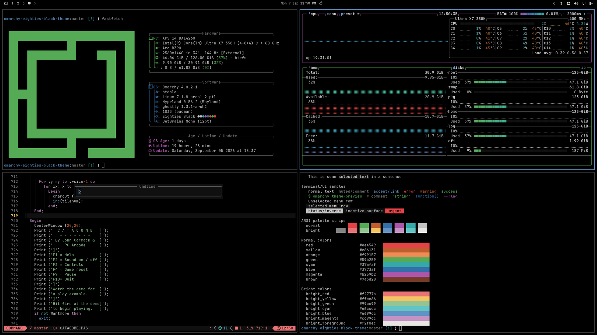

# Eighties Black

Omarchy theme. [Chris Kempson](http://chriskempson.com)'s Eighties palette on true black (`#000000`).



## Install

```bash
omarchy theme install https://github.com/j-c-m/omarchy-eighties-black-theme.git
```

## Palette

| | hex |
|---|---|
| background | `#000000` |
| foreground | `#cccccc` |
| accent | `#6699cc` |
| red / yellow / green / cyan / blue / magenta | `#ee4549` `#c86131` `#59b259` `#37afaf` `#3773af` `#b259b2` |
| bright | `#f2777a` `#ffcc66` `#99cc99` `#66cccc` `#6699cc` `#cc99cc` |
| muted / bright white | `#888888` `#f2f0ec` |
| ANSI 0 | `#111111` |

Ghostty, Alacritty, Kitty, and Foot map ANSI 0 to `#111111` (not the background) and invert cursor/selection from the cell.
