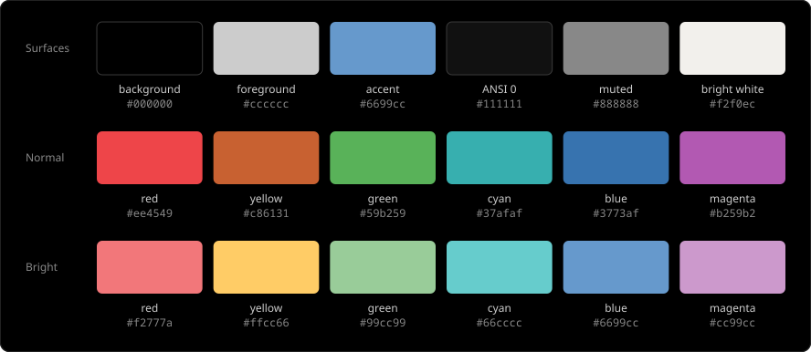

# Eighties Black

Omarchy theme. [Chris Kempson](http://chriskempson.com)'s Eighties palette on true black (`#000000`).


## Install

```bash
omarchy theme install https://github.com/j-c-m/omarchy-eighties-black-theme.git
```

## Palette



Ghostty, Alacritty, Kitty, and Foot map ANSI 0 to `#111111` (not the background) and invert cursor/selection from the cell.
